# Deploy Starbucks Clone on Nginx Server

1. **Access the Killerkoda Ubuntu Playground:**
   - Open your web browser and navigate to [Killerkoda Ubuntu Playground](https://killercoda.com/playgrounds/scenario/ubuntu).


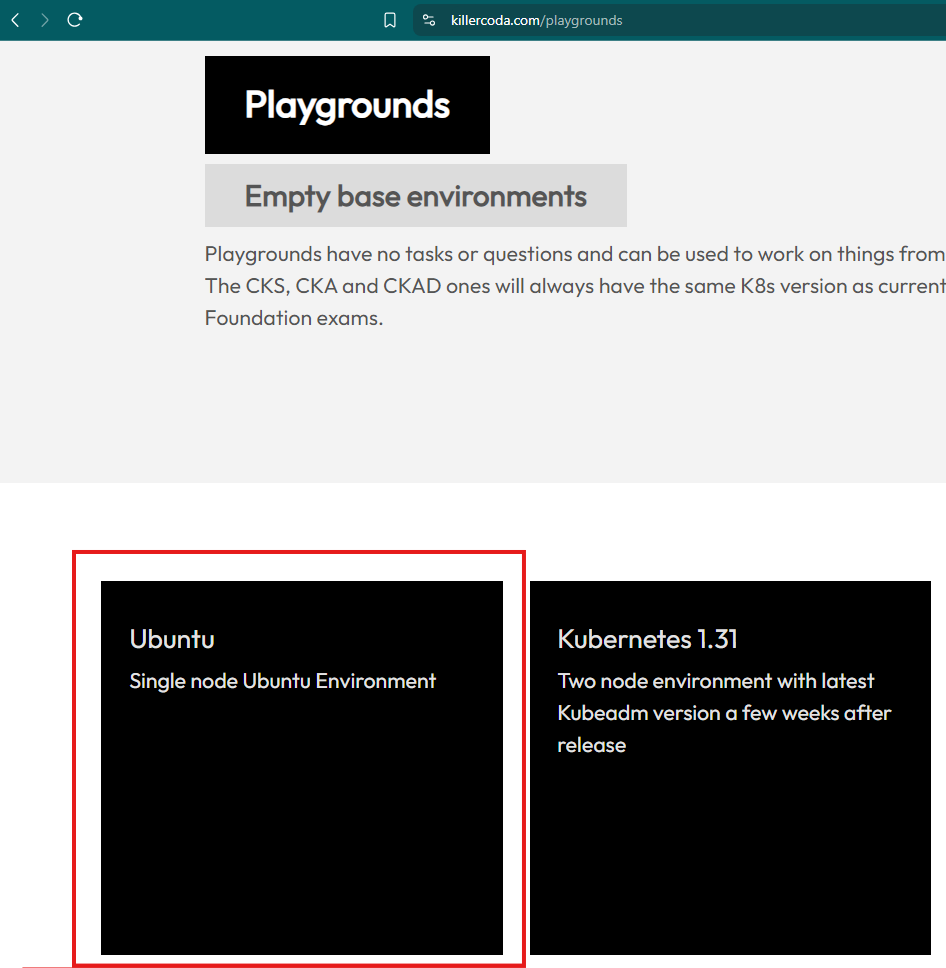

2. **Initialize the Playground:**
   - Click on the "Start" button to initialize the Ubuntu environment.

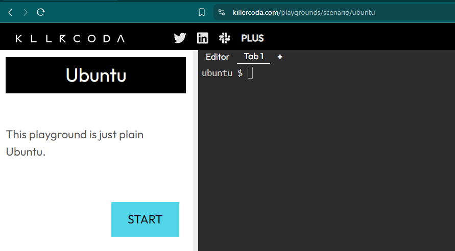

3. **Update the System:**
   - Once the playground is ready, update the package list by running:
     ```sh
     sudo apt update
     ```
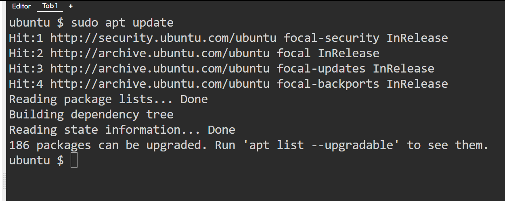

4. **Install Nginx:**
   - Install Nginx web server:
     ```sh
     sudo apt install nginx -y
     ```

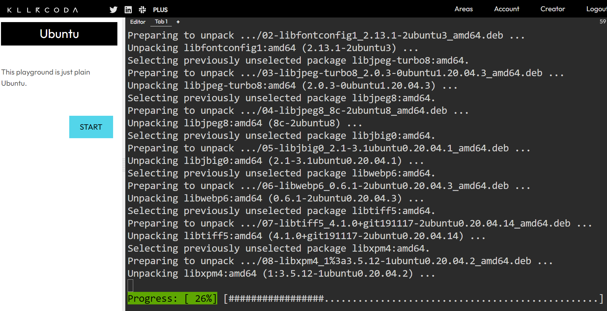
5. **Clone the Starbucks Clone Repository:**
   - Clone the repository containing the build artifacts:
     ```sh
     git clone https://github.com/sam6shk/starbucks.git 
     ```
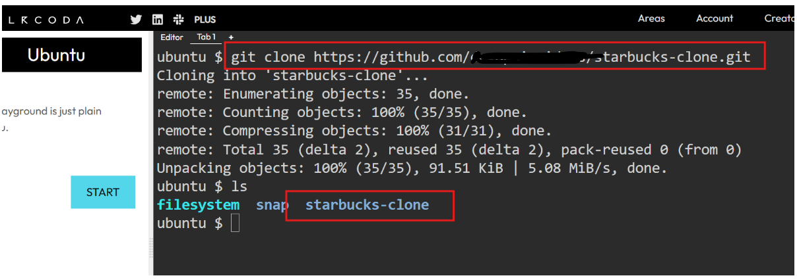
6. **Copy Build Artifacts to Nginx Directory:**
   - Navigate to the cloned repository:
     ```sh
     cd starbucks-clone
     ```
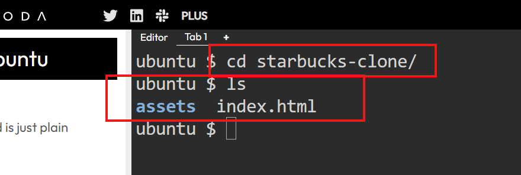

   - Copy the build artifacts to the Nginx web root directory:
     ```sh
     sudo cp -r * /var/www/html/
     ```
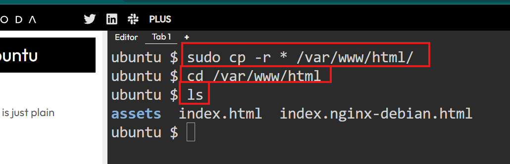

7. **Check Nginx Status:**
   - Check Nginx  Status:
     ```sh
     sudo systemctl status nginx
     ```
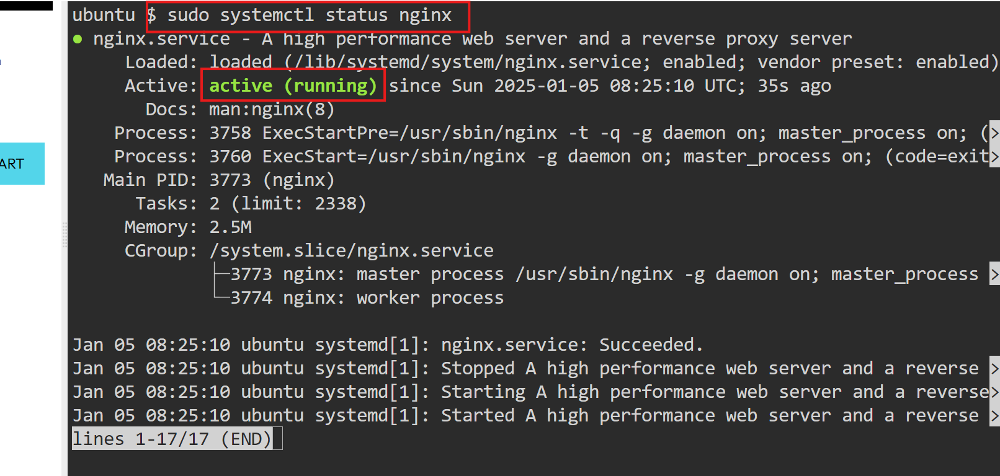

9. **Expose Port 80:**
    - In the Killerkoda interface, look for the option to expose a port. This is typically done by clicking on an option labeled "Expose" or similar and then selecting or entering port `80`.

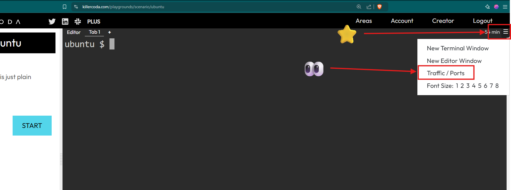

10. **Access Starbucks Clone:**
    - Once port 80 is exposed, you should see a URL or a button to open the application in a new tab. Click on it, and you should be able to access the Starbucks Clone application.

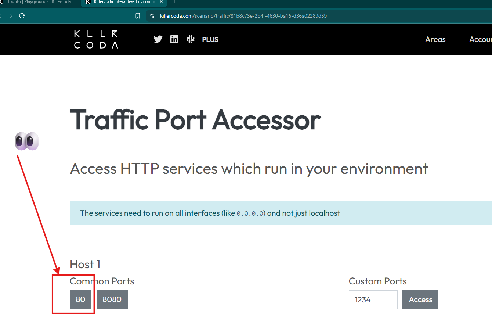

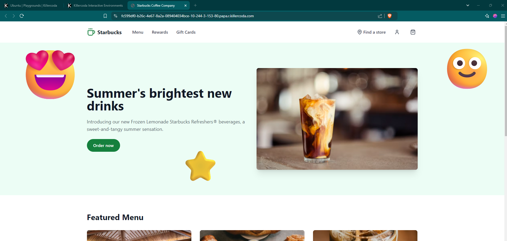

By following these steps, the Starbucks Clone application should be deployed and accessible via port 80 on the Killerkoda Ubuntu playground.

